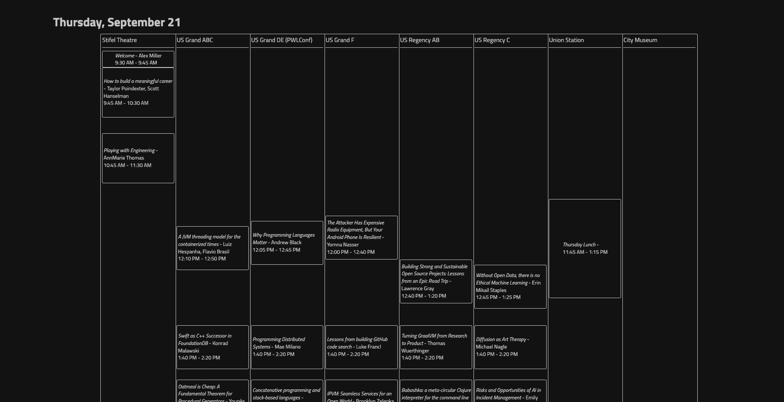

# scheduler

This is a tool for generating an HTML schedule for a gathering like a conference where the events are displayed relative to each other based on their start and end times.

To use, paste or a type a CSV file into the text area. Include the following columns in any order `title,name,start,end,link,venue` followed by corresponding rows. Each row represents a single event. 

This is an example schedule I generated for Strange Loop:

Once you generate a schedule, you can download the HTML for it using devtools and style as desired. 
